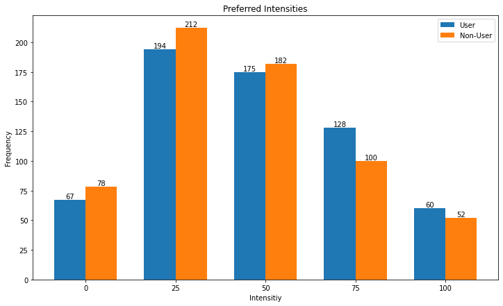

# Einfluss von Social Media Nutzung auf die Wahrnehmung von Bildbearbeitungsfiltern

## Dominik Göller, Christopher Schahn

### Seminar: Visuelle Wahrnehmung beim Menschen und Bildqualität - SoSe 21


```python
import pandas as pd    # module to work with data in DataFrames.
import numpy as np
import seaborn as sns  # module to plot DataFrames in an easy way
import matplotlib.pyplot as plt
from IPython.display import Image
```

## 1. Einleitung

Im Social Media Bereich, insbesondere auf Instagram, wird viel mit Filtern und Bildbearbeitung gearbeitet, um den Konsumenten eine vermeintlich bessere Bildqualität  zu suggerieren. Die Forschungsfrage dieser Arbeit lautet: "Wirkt sich Social Media Konsum auf die Wahrnehmung von Bildbearbeitungsfiltern aus?" Dabei wurden die folgenden  Hypothesen aufgestellt: 

**1) Fotos mit Filtern werden von langzeit Social Media Nutzern als optisch ansprechender empfunden.**

**2) Filter in Fotos werden von langzeit Social Media Nutzern eher erkannt, als von nicht Social Media Nutzern.**

Um die Hypothesen und die Fragestellung zu testen, wurden zwei Experimente durchgeführt, bei denen Bilder mit Instagram Filtern bearbeitet und subjektiv bewertet wurden. Im ersten Experiment haben Versuchsteilnehmer Bildpaare desselben Motivs in verschiedenen Bearbeitungsstärken verglichen. Dabei sollte in jedem Durchlauf die optisch ansprechendere Bildvariante gewählt werden. Bei dem zweiten Experiment wurden unterschiedlich stark bearbeitete Bilder einzeln betrachtet. Der Proband sollte auf einer Skala einschätzen, wie stark das Bild bearbeitet war. Beide Versuche wurden in Python Code implementiert, der teilweise auf der von Guillermo Aguilar zur Verfügung gestellten Codevorlage basiert.

## 2. Experimentelles Design

Vor dem Beginn der Experimente wurden die Versuchsteilnehmer befragt, ob sie Social Media nutzen. Je nach Antwort wurden sie in zwei Gruppen aufgeteilt. Bei Antwort _ja_ (mindestens 3h pro Woche) wurden sie der Gruppe der Social Media Nutzer und bei Antwort _nein_ (gar keine Social Media Nutzung) der Gruppe der nicht Social Media Nutzer zugeteilt. Als Motive wurden vier frei zugängliche Fotos ohne Copyright verwendet. Diese wurden dann mit drei Instagram Filtern **Clarendon**, **Juno** und **Lark** bearbeitet. Jedes Motiv wurde mit allen drei Filtern in den Intensitätsstufen 0%, 25%, 50%, 75% und 100% bearbeitet. Die Bearbeitung fand mithilfe der Instagram App statt. In der folgenden Abbildung sind alle vier Motive jeweils als Original und in maximaler Intensität der drei Filter zu sehen.


```python
Image("stimuli.png", height=800, width=800)
```


    

    


### Experiment 1

#### Bevorzugte Filterstärken
Für das erste Experiment wurde die Bildauswahl auf zwei Motive reduziert. Es wurden die Bilder der beiden Frauen jeweils mit sich selbst und mit allen möglichen Variationen desselben Motivs verglichen. Die Versuchspersonen mussten dann entweder das linke oder das rechte Bild wählen, je nachdem welches sie als schöner empfunden haben. So gab es pro Durchlauf insgesamt 156 Vergleiche. Drei verschiedene Filter multipliziert mit vier verschiedenen Intensitätsstufen von 25% - 100% addiert mit Intensität 0% (Originalbild). Daraus ergeben sich **13** Möglichkeiten pro Motiv. Von diesen 13 werden in jedem Versuchsschritt zwei miteinander vergleichen, was dem Ziehen ohne Zurücklegen ohne Beachtung der Reihenfolge entspricht. So ergeben sich  = 78 mögliche Kombinationen pro Motiv. Für beide Motive ergeben sich also 156 Vergleiche. Das hierfür verwendete Design File wurde mit dem Python Skript unter /design-creator/main.py erstellt. Dort ist auch das Design File als .csv Datei zu finden. Ein Versuchsschritt des ersten Experiments ist im nachfolgendem Bild zu sehen.


```python
Image("pair.png", height=600, width=600)
```


    

    


### Experiment 2

#### Geschätzte Filterstärke

In diesem Experiment wurden den Versuchspersonen alle Variationen der vier Motive jeweils einzeln gezeigt. Für jedes Bild sollte dann die geschätzte Intensität der Bearbeitung angegeben werden. Es konnte bei jedem Bild zwischen 1, 2, 3, 4, 5 ausgewählt werden, wobei 1 - 0%, 2 - 25%, 3 - 50%, 4 - 75%, 5 - 100% Filterintensität entsprochen hat. Insgesamt gab es pro Versuchsdurchlauf 60 Einstufungen. Vier verschiedene Motive multipliziert mit drei verschiedenen Filtern multipliziert mit den jeweils fünf verschiedenen Intensitätsstufen (die Intensität von 0% gab es bei allen Filtertypen). Ergibt $4 \cdot 3 \cdot 5  = 60$ Vergleiche. Auch das hier verwendete Design Python Skript liegt unter /design-creator/single_main.py zusammen mit dem .csv Design File.

### Ablauf der Experimente

An den Experimenten haben insgesamt 8 Personen teilgenommen, darunter vier Social Media Nutzer und vier nicht Social Media Nutzer. Für beide Versuche wurden ungefähr 30 Minuten benötigt. Es stand den Teilnehmern frei, Pausen während der Versuche zu machen.

## Ergebnisse

### Bevorzugte Filterintensitäten


```python
def add_name_and_response(df, name):
    image_name = df['image_a'].str.split("_", n = 1, expand = True)[0]
    df.insert(1, 'name', image_name)
    df['observer'] = name
    return df


def compute_means_and_std(d_frame, observers):
    user = d_frame
    user_count = {'0': [], '25': [], '50': [], '75': [], '100': []}

    for observer in observers:
        u_name = user.loc[user['observer'] == observer]
        (unique, user_counts) = np.unique(u_name['chosen_i'], return_counts=True)

        for intens, count in zip(unique, user_counts):
            user_count[str(intens)].append(count)

    user_means, user_std = [], []

    keys = ['0', '25', '50', '75', '100']
    
    for key in keys:
        user_means.append(np.mean(user_count[key]))
        user_std.append(np.std(user_count[key]))


    return np.asarray(user_means), np.asarray(user_std)
```


```python
# we read the data
chris   = pd.read_csv('../double_auswertung/pair_results/chris_pair_result_1.csv')
clemens = pd.read_csv('../double_auswertung/pair_results/clemens_pair_result_1.csv')
daniel  = pd.read_csv('../double_auswertung/pair_results/daniel_pair_result_2.csv')
jenny   = pd.read_csv('../double_auswertung/pair_results/jenny_pair_result_1.csv')
katja   = pd.read_csv('../double_auswertung/pair_results/katja_pair_result_1.csv')
laurenz = pd.read_csv('../double_auswertung/pair_results/laurenz_pair_result_1.csv')
paul    = pd.read_csv('../double_auswertung/pair_results/paul_pair_result_1.csv')
dominik = pd.read_csv('../double_auswertung/pair_results/dominik_pair_result_1.csv')

df1 = add_name_and_response(chris, 'Chris')
df2 = add_name_and_response(clemens, 'Clemens')
df3 = add_name_and_response(daniel, 'Daniel')
df4 = add_name_and_response(jenny, 'Jenny')
df5 = add_name_and_response(katja, 'Katja')
df6 = add_name_and_response(laurenz, 'Laurenz')
df7 = add_name_and_response(paul, 'Paul')
df8 = add_name_and_response(dominik, 'Dominik')

df = pd.concat((df1, df2, df3, df4, df5, df6, df7, df8))
df_sanity = df1

observers = ['Chris', 'Clemens', 'Daniel', 'Jenny', 'Katja', 'Laurenz', 'Paul', 'Dominik']
```


```python
user = df.loc[df['usage'] == 'yes']
non_user = df.loc[df['usage'] == 'no']

(unique, user_counts) = np.unique(user['chosen_i'], return_counts=True)
(unique, non_user_counts) = np.unique(non_user['chosen_i'], return_counts=True)

labels = ['0', '25', '50', '75', '100']
x = np.arange(len(labels))
width=0.35

fig, ax = plt.subplots(figsize=(12,7))
p1 = ax.bar(x - width/2, user_counts, width=width, label='User')
p2 = ax.bar(x + width/2, non_user_counts, width=width, label='Non-User')

ax.set_xticks(x)
ax.set_xticklabels(labels)
ax.bar_label(p1)
ax.bar_label(p2)
ax.set_xlabel('Intensitiy')
ax.set_ylabel('Frequency')

plt.title('Preferred Intensities')

plt.legend();
```


    

    


Auf dieser Abbildung sind die absoluten Häufigkeiten der einzelnen Filterintensitäten zu erkennen. Zum Beispiel wurde Intensität 25 von den Social Media Nutzern 194 Mal als bevorzugte Intensität gewählt, von den nicht Social Media Nutzern 212 Mal. Insgesamt ist eine Tendenz zu erkennen, dass nicht Social Media User niedrigere Intensitäten und Social Media User eher höhere Intensitäten bevorzugen. Bei Intensität 50 liegen beide Versuchsgruppen ungefähr gleich auf. Generell wurde die Intensität 25% von beiden Gruppen am häufigsten gewählt, was darauf hindeutet, dass sie als die optisch ansprechendste empfunden wurde.


```python
user = df.loc[df['usage'] == 'yes']
non_user = df.loc[df['usage'] == 'no']

(unique, user_counts) = np.unique(user['chosen_i'], return_counts=True)
(unique, non_user_counts) = np.unique(non_user['chosen_i'], return_counts=True)

labels = ['0', '25', '50', '75', '100']
x = np.arange(len(labels))

fig, ax = plt.subplots(figsize=(12,7))
ax.grid()
ax.plot(x, user_counts, linestyle='-', marker='o', label='User')
ax.plot(x, non_user_counts, linestyle='-', marker='o', label='Non-User')
ax.set_xticks(x)
ax.set_xticklabels(labels)
ax.set_xlabel('Intensitiy')
ax.set_ylabel('Frequency')

plt.title('Preferred Intensities')

plt.legend();
```


    

    


Diese Abbildung basiert auf denselben Werten wie die Vorherige. Hier sind die Tendenzen der beiden Gruppen etwas deutlicher zu erkennen. Dieses Diagramm, zusammen mit dem Vorherigen, stützen Hypothese 1, die besagt, dass Social Media Nutzer eine höhere und nicht Social Medai Nutzer eine niedrigere Intensität bevorzugen.


```python
user = df.loc[df['usage'] == 'yes']
non_user = df.loc[df['usage'] == 'no']

users = ['Daniel', 'Katja', 'Laurenz', 'Dominik']
non_users = ['Chris', 'Clemens', 'Jenny', 'Paul']

labels = ['0', '25', '50', '75', '100']
x = np.arange(len(labels))


fig, axis = plt.subplots(nrows=1, ncols=2, sharey=True, figsize=(17,8))


ax = axis[0]

for u in users:
    observ = user.loc[user['observer'] == u]
    (unique, counts) = np.unique(observ['chosen_i'], return_counts=True)
    ax.plot(x, counts, linestyle='-', marker='o', label=u)
    ax.set_xticks(x)
    ax.set_xticklabels(labels)
    ax.set_xlabel('Intensitiy')
    ax.set_ylabel('Frequency')
    ax.grid()
    ax.legend()
    ax.set_title('Social Media Users')

ax = axis[1]    

for nu in non_users:
    observ = non_user.loc[non_user['observer'] == nu]
    (unique, counts) = np.unique(observ['chosen_i'], return_counts=True)
    ax.plot(x, counts, linestyle='-', marker='o', label=nu)  
    ax.set_xticks(x)
    ax.set_xticklabels(labels)
    ax.set_xlabel('Intensitiy')
    ax.set_ylabel('Frequency')
    ax.grid()
    ax.legend()
    ax.set_title('Non-Social Media Users')
```


    

    


In dieser Grafik sind die einzelnen Versuchsteilnehmer der beiden Gruppen abgebildet. Es zeigt sich, dass innerhalb der Gruppen keine eindeutige Präferenz zu erkennen ist. So ist in der Social Media Gruppe eine hohe Varianz bei einer Intensität von 25 und 75 zu erkennen. Was aus der Grafik jedoch klar hervorgeht, ist, dass es bei der Social Media Gruppe eine Ausbeulung bei 75 gibt, wohingegen bei der nicht Social Media Gruppe ein Einknick zu erkennen ist.


```python
user = df.loc[df['usage'] == 'yes']
non_user = df.loc[df['usage'] == 'no']
filters = ['Clarendon', 'Juno', 'Lark']


(unique, user_counts) = np.unique(user['chosen_i'], return_counts=True)
(unique, non_user_counts) = np.unique(non_user['chosen_i'], return_counts=True)

labels = ['0', '25', '50', '75', '100']
x = np.arange(len(labels))
width=0.35

fig, axis = plt.subplots(nrows=1, ncols=3, sharey=True, figsize=(24,8))


for col, fi in zip(range(3), filters):
    ax = axis[col]

    user_f = user.loc[user['chosen_f'] == fi]
    non_user_f = non_user.loc[non_user['chosen_f'] == fi]

    (unique, user_counts) = np.unique(user_f['chosen_i'], return_counts=True)
    (unique, non_user_counts) = np.unique(non_user_f['chosen_i'], return_counts=True)
    ax.grid()
    ax.plot(x, user_counts, linestyle='-', marker='o', label='User')
    ax.plot(x, non_user_counts, linestyle='-', marker='o', label='Non-User')

    ax.set_xticks(x)
    ax.set_xticklabels(labels)
    ax.set_xlabel('Intensitiy')
    ax.set_ylabel('Frequency')

    ax.set_title(fi)
    ax.legend()

plt.legend();
```


    

    


Aus dieser Abbildung wird deutlich, dass die erste Hypothese durch die Ergebnisse von zwei der drei Filtern gestützt wird. Sowohl bei Juno als auch bei Lark sind die Social Media User bei höheren Intensitäten präsenter, als die nicht Social Media User. Der Filter Clarendon wurde tendenziell von nicht Social Media Usern eher bevorzugt, als von der anderen Gruppe.


```python
user = df.loc[df['usage'] == 'yes']
non_user = df.loc[df['usage'] == 'no']
filters = ['Clarendon', 'Juno', 'Lark']
images = ['Girl1', 'Girl2']

(unique, user_counts) = np.unique(user['chosen_i'], return_counts=True)
(unique, non_user_counts) = np.unique(non_user['chosen_i'], return_counts=True)

labels = ['0', '25', '50', '75', '100']
x = np.arange(len(labels))
width=0.35

fig, ax = plt.subplots(figsize=(12,7))

user_means, user_std = compute_means_and_std(user, observers)
non_user_means, non_user_std = compute_means_and_std(non_user, observers)

p1 = ax.bar(x - width/2, user_means, yerr=user_std, width=width, label='User')
p2 = ax.bar(x + width/2, non_user_means, yerr=non_user_std, width=width, label='Non-User')

ax.set_xticks(x)
ax.set_xticklabels(labels)
ax.set_xlabel('Intensitiy')
ax.set_ylabel('Mean of Frequency')

ax.set_title('Mean of Frequencies over all images and filters')
ax.legend()

plt.legend();
```


    

    


Dieses Diagramm zeigt, wie häufig eine Filterintensität im Durchschnitt von einem (nicht) Social Media Nutzer als optisch ansprechender empfunden wurde. Dazu zeigt der vertikale schwarze Balken die Standardabweichung. Es lässt sich auch hier die Tendenz erkennen, die Hypothese 1 unterstützt. Jedoch zeigt sich, dass die Gruppe der Social Media User (außer bei Intensität 50) nicht so einstimmig entschieden haben, wie die nicht Social Media User. Dies spiegelt sich in der Standardabweichung wider, die, abgesehen von Intensität 50%, bei allen Intensitäten bei den Social Media Usern höher als bei den nicht Social Media Usern ist.


```python
user = df.loc[df['usage'] == 'yes']
non_user = df.loc[df['usage'] == 'no']
filters = ['Clarendon', 'Juno', 'Lark']
images = ['Girl1', 'Girl2']

(unique, user_counts) = np.unique(user['chosen_i'], return_counts=True)
(unique, non_user_counts) = np.unique(non_user['chosen_i'], return_counts=True)

labels = ['0', '25', '50', '75', '100']
x = np.arange(len(labels))
width=0.35

fig, axis = plt.subplots(nrows=1, ncols=3, sharey=True, figsize=(24,8))


for col, fi in zip(range(3), filters):
    ax = axis[col]


    user_f = user.loc[user['chosen_f'] == fi]
    non_user_f = non_user.loc[non_user['chosen_f'] == fi]

    user_means, user_std = compute_means_and_std(user_f, observers)
    non_user_means, non_user_std = compute_means_and_std(non_user_f, observers)

    p1 = ax.bar(x - width/2, user_means, yerr=user_std, width=width, label='User')
    p2 = ax.bar(x + width/2, non_user_means, yerr=non_user_std, width=width, label='Non-User')

    ax.set_xticks(x)
    ax.set_xticklabels(labels)
    ax.set_xlabel('Intensitiy')
    ax.set_ylabel('Mean of Frequency')

    ax.set_title(fi)
    ax.legend()

plt.legend();
```


    

    


Hier sind die gleichen Daten der vorherigen Abbildung unterteilt in die einzelnen Filter abgebildet.

### Geschätzte Filterstärke

Die folgende Abbildung zeigt den Mittelwert aus den geschätzten Filterintensitäten für beide Versuchsgruppen, inklusive der Standardabweichung als schattierter Bereich. Es wurden alle Versuchsbilder betrachtet.
Die erste Beobachtung ist, dass bei beiden Versuchsgruppen der Mittelwert für die Filterstärke 0% bei mehr als 20% lag. Obwohl im vorherigen Experiment gezeigt wurde, dass die Versuchsteilnehmer konsequent die Filterstärke 25% am optisch ansprechendsten empfinden.
Außerdem ist auffällig, dass die nicht Social Media Nutzer die Bilder mit höherer Filterstärke besser erkannt haben, als die Gruppe der Social Media Nutzer und auch bei den Filterstärken 0% und 25% deutlich näher am richtigen Wert lagen. Diese Feststellung widerspricht der zweiten Hypothese, jedoch kann daraus aufgrund der niedrigen Teilnehmerzahl keine klare Widerlegung abgeleitet werden.


```python
def add_name_and_response(df, name):
    image_name = df['image'].str.split("_", n = 1, expand = True)[0]
    df['observer'] = name
    df.insert(4, 'response_i', df['response'])
    df.insert(2, 'name', image_name)
    df.loc[df['response'] == 1, 'response_i'] = 0
    df.loc[df['response'] == 2, 'response_i'] = 25
    df.loc[df['response'] == 3, 'response_i'] = 50
    df.loc[df['response'] == 4, 'response_i'] = 75
    df.loc[df['response'] == 5, 'response_i'] = 100
    return df
```


```python
def compute_means_and_std(d_frame, observers):
    user = d_frame
    user_count = {'0': [], '25': [], '50': [], '75': [], '100': []}

    for intens in range(0,101,25):
        u_name = user.loc[user['intensity'] == intens]
        (unique, user_counts) = np.unique(u_name['response_i'], return_counts=True)
        
        #for intens, count in zip(unique, user_counts):
        user_count[str(intens)].append(u_name['response_i'].tolist())
        
            

    user_means, user_std = [], []

    keys = ['0', '25', '50', '75', '100']
    
    for key in keys:
        user_means.append(np.mean(user_count[key]))
        user_std.append(np.std(user_count[key]))
        #user_std.append(np.var(user_count[key]))


    return np.asarray(user_means), np.asarray(user_std)
```


```python
# we read the data
chris = pd.read_csv('../single_auswertung/single_results/chris_single_result_1.csv')
clemens = pd.read_csv('../single_auswertung/single_results/clemens_single_result_1.csv')
daniel = pd.read_csv('../single_auswertung/single_results/daniel_single_result_2.csv')
jenny = pd.read_csv('../single_auswertung/single_results/jenny_single_result_1.csv')
katja = pd.read_csv('../single_auswertung/single_results/katja_single_result_1.csv')
laurenz = pd.read_csv('../single_auswertung/single_results/laurenz_single_result_1.csv')
paul = pd.read_csv('../single_auswertung/single_results/paul_single_result_1.csv')
dominik = pd.read_csv('../single_auswertung/single_results/dominik_single_result_1.csv')

df1 = add_name_and_response(chris, 'Chris')
df2 = add_name_and_response(clemens, 'Clemens')
df3 = add_name_and_response(daniel, 'Daniel')
df4 = add_name_and_response(jenny, 'Jenny')
df5 = add_name_and_response(katja, 'Katja')
df6 = add_name_and_response(laurenz, 'Laurenz')
df7 = add_name_and_response(paul, 'Paul')
df8 = add_name_and_response(dominik, 'Dominik')


df = pd.concat((df1, df2, df3, df4, df5, df6, df7, df8))


# 3 different filter values
observer = np.asarray(df['observer'].unique())
```


```python
# selecting data for only one picture
picname = 'Girl1'
#d = df[df['name'] == picname]
d = df
#d = d[d['intensity'] == d['response_i']]

user = d.loc[d['usage'] == 'yes']
non_user = d.loc[d['usage'] == 'no']
means_u, std_u = compute_means_and_std(user, observer)
means_n, std_n = compute_means_and_std(non_user, observer)


# plotting
X = ['0', '25', '50', '75', '100']
x = np.arange(len(X))
fig, ax = plt.subplots(figsize=(12,8))

ax.plot(X, means_u, lw=2, label='User', linestyle='-', marker='o')
ax.plot(X, means_n, lw=2, label='Non-User',  linestyle='-', marker='o')

ax.fill_between(X, means_u+std_u, means_u-std_u,  alpha=0.2)
ax.fill_between(X, means_n+std_n, means_n-std_n, alpha=0.2)

ax.set_title('All Pictures')
#ax.set_yticklabels()
ax.set_xticklabels(X)
ax.legend(loc='upper right')
ax.set_xlabel('Real Intensities')
ax.set_ylabel('Mean of guessed Intensities')
ax.grid()


```

    <ipython-input-22-0fe3ea342a44>:26: UserWarning: FixedFormatter should only be used together with FixedLocator
      ax.set_xticklabels(X)


    

    


### Geschätzte Filterstärke

Die folgende Abbildung zeigt die Anzahl der gewählten Antworten für jede Intensitätsstufe, wobei zwischen den Versuchsgruppen unterschieden wird und alle Versuchsbilder betrachtet werden. Die gestrichelte Linie markiert den y-Wert 48. Dies ist die genaue Anzahl an Bildern, die es pro Intensitätsstufe gibt. Für jede Intensitätsstufe gibt es 4 Motive mit jeweils 3 Filtern, also insgesamt 12 Bilder. Hier geht klar hervor, dass die nicht Social Media Nutzer die Filterstärke auf jeder Intensitätsstufe besser erkannt haben, als die Social Media Nutzer. Sehr deutlich fällt auf, dass Social Media Nutzer extrem stark bearbeitete Bilder, sowie unbearbeitete Bilder, nicht als solche einstufen.


```python

user = d.loc[d['usage'] == 'yes']
non_user = d.loc[d['usage'] == 'no']

(unique, user_counts) = np.unique(user['response_i'], return_counts=True)
(unique, non_user_counts) = np.unique(non_user['response_i'], return_counts=True)

labels = ['0', '25', '50', '75', '100']
x = np.arange(len(labels))
width=0.35

fig, ax = plt.subplots(figsize=(10,5))
p1 = ax.bar(x - width/2, user_counts, width=width, label='User')
p2 = ax.bar(x + width/2, non_user_counts, width=width, label='Non-User')

ax.hlines(y = 48, xmin = 0.5, xmax = 4.5, linestyles='dashed', color="k")
ax.text(-0.5, 48, 'Actual Frequency', ha ='left', va ='center')

ax.set_xticks(x)
ax.set_xticklabels(labels)
ax.bar_label(p1, padding=3)
ax.bar_label(p2, padding=3)
ax.set_xlabel('Response')
ax.set_ylabel('Frequency')

plt.title('Responses')

plt.legend();
```


    

    


## 4. Diskussion

Insgesamt konnte eine Auswirkung von Social Media Konsum auf die Wahrnehmung festgestellt werden, wodurch die Fragestellung hinreichend beantwortet wurde. Jedoch zeichnen sich die Ergebnisse der Auswertung der Hypothesen nur als Trends ab, da aufgrund der geringen Versuchsteilnehmerzahl kein klares Ergebnis ermittelt werden konnte. Hierfür wäre eine Umfrage in größerem Stil notwendig.

Die erste Hypothese,

**1) Fotos mit Filtern werden von Langzeit Social Media Nutzern als optisch ansprechender empfunden**,

wird von den Ergebnissen des ersten Versuchs unterstützt. Wie oben beschrieben, ließ sich eine Tendenz feststellen, die darauf hindeutet,
dass Social Media Nutzer häufiger eine höhere Intensität und umgekehrt nicht Social Media Nutzer eine niedrigere Intensität bevorzugen.

Die zweite Hypothese,

**2) Filter in Fotos werden von Langzeit Social Media Nutzern eher erkannt als von nicht Social Media Nutzern**,

kann als "widerlegt" angesehen werden. Die Ergebnisse des zweiten Experiments verdeutlichen, dass hoher Social Media Konsum nicht zu einer besseren Wahrnehmung von Filtern führt. Diese Einschätzung wird durch die obigen Grafiken bekräftigt. 

Überraschend war, dass trotz der geringen Unterscheidung beider Gruppen im Intensitätsbereich von 0% bis 25% Bilder mit 25% eindeutig Bildern mit 0% bevorzugt wurden. Grund hierfür könnte sein, dass es schwer ist, die Intensität ohne Referenzbild einzustufen. Bei paarweisen Vergleichen ist es jedoch einfacher, einen Unterschied zu erkennen.


### Probleme

Durch die geringe Teilnehmerzahl und die niedrige Anzahl verwendeter Stimuli ist keine klare Aussage bezüglich der Fragestellung möglich. Zudem war die frei zugängliche Datenbank im geeigneten Bildmaterial eingeschränkt. Die Erhöhung der Stimuli würde zu einem genaueren Ergebnis führen. Jedoch würde dies die bereits von den Teilnehmern als lang empfundene Dauer des Experiments weiter stark erhöhen. Das Experiment wurde noch dazu als _eintönig_ beschrieben.
Die Zahl der möglichen Versuchsteilnehmer war zudem stark eingeschränkt, da der Versuch lokal auf unseren eigenen Notebooks durchgeführt wurde.


### Verbesserungsvorschläge

Offensichtlich würde eine höhere Anzahl an Teilnehmern und Stimuli das Ergebnis deutlich verbessern und eine genauere Aussage ermöglichen. Dazu müsste das Experiment besser verfügbar sein, beispielsweise als online Umfrage.

### Ausblick

Insgesamt wurde festgestellt, dass Social Media Konsum ein nicht zu vernachlässigender Faktor in der Wahrnehmung von Bildern darstellt. Bei ca. 4,2 Milliarden aktiven Social Media Nutzern im Jahre 2021 $^1$ sollte dies in Studien zu Wahrnehmung und Bildqualität unbedingt berücksichtigt werden.

### Referenzen

$^1$: https://de.statista.com/statistik/daten/studie/739881/umfrage/monatlich-aktive-social-media-nutzer-weltweit/

$^2$: https://www.signatureedits.com/free-raw-photos/


```python

```
